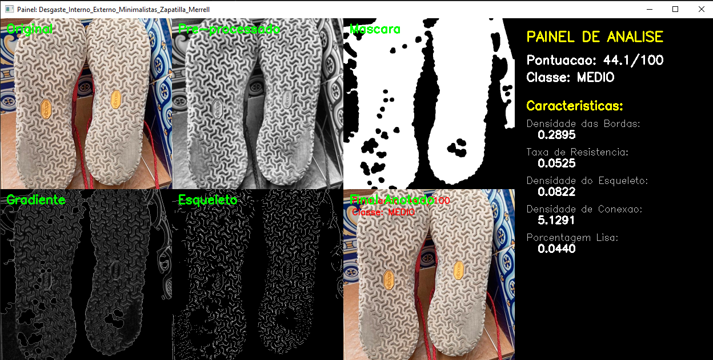

# Feito por:
- Cleyton Souza Martins - 24820
- Maria Julia Facirolli - 25071

---

# Exemplo


---

# Vídeo Demonstrativo
https://www.youtube.com/watch?v=lXBS3p8J6YU

---

# Detecção de Desgaste em Solados de Calçados

Este projeto é um sistema automatizado em Python capaz de detectar e quantificar o nível de desgaste em solados de calçados a partir de imagens. Ele avalia o quão "gasto" (ou liso) está o padrão de aderência do sapato e fornece uma Pontuação de Desgaste (0 a 100) e uma classificação qualitativa (BAIXO, MÉDIO ou ALTO).

---

## Tecnologias Utilizadas

O projeto foi construído em Python e focado em bibliotecas de processamento clássico:
- **Python 3.10+**
- **OpenCV**: Para leitura, conversão de cor, transformações morfológicas e geração dos painéis visuais.
- **NumPy**: Para manipulação eficiente de matrizes de imagens.
- **Scikit-Image**: Especificamente para operações avançadas como esqueletização.
- **Matplotlib**: (Disponível como utilitário para visualização e depuração).

---

## Instalação das Dependências

Para rodar o projeto, você precisa ter as bibliotecas instaladas no seu ambiente Python. Use o arquivo `requirements.txt` que acompanha o projeto.

1. Clone ou baixe o projeto.
2. Abra o terminal na pasta do projeto e rode o comando:
```bash
pip install -r requirements.txt
```

---

## Como Usar

O projeto possui uma interface de linha de comando (`CLI`) flexível, processando tanto arquivos individuais quanto diretórios completos de imagens.

### Processar Múltiplas Imagens (Modo Lote/Batch)
Para processar todas as imagens dentro de uma pasta e exibir um painel visual para cada uma:
```bash
python main.py --input inputs --batch --show
```
*Dica: Pressione qualquer tecla enquanto a janela da imagem estiver aberta para prosseguir para a próxima.*

### Processar uma Única Imagem
```bash
python main.py --input inputs/minha_foto_do_sapato.jpg --show
```

### Salvar Imagens Intermediárias
Para salvar todas as etapas (tons de cinza, máscara, gradiente, etc) para inspeção, adicione a flag `--debug`:
```bash
python main.py --input inputs --batch --debug
```
*Os resultados ficarão disponíveis na pasta `/results`.*

---

## Técnicas de Visão Computacional Envolvidas

O coração desta aplicação está análise estrutural matemática do padrão dos solados. O fluxo do processamento é dividido nas seguintes técnicas:

### 1. Pré-processamento
* **CLAHE (Contrast Limited Adaptive Histogram Equalization):** Utilizado para normalizar de forma adaptativa a luz da imagem, garantindo que sombras no solado não atrapalhem a análise.
* **Filtro Gaussiano:** Borramento suave para remover pequenos "ruídos" das imagens fotográficas.

### 2. Segmentação
* **Limiarização de Otsu:** O algoritmo encontra automaticamente um valor de corte para separar o sapato do fundo da imagem com base nas características do histograma.
* **Abertura e Fechamento Morfológico:** Limpam ruídos soltos no fundo da imagem e preenchem "buracos" dentro do solado segmentado, obtendo assim uma máscara binária sólida da área do pé.

### 3. Análise Morfológica
* **Gradiente Morfológico:** Calculado como a diferença entre a Dilatação e a Erosão. Isso realça fortemente as "bordas" e elevações dos padrões de aderência do tênis.
* **Simulação de Desgaste com Erosão:** Aplicamos um kernel de erosão na imagem das bordas do solado. Áreas onde o "pneu" do sapato está muito fino/gasto desaparecem por completo rapidamente ao sofrerem erosão matemática, atuando como um forte indicativo de degradação estrutural.
* **Esqueletização:** Reduz o padrão do solado à sua estrutura central (1 pixel de espessura).

### 4. Extração de Características e Heurística de Pontuação:
* **Densidade das Bordas:** Proporção entre pixels das ranhuras e o total de área do sapato.
* **Porcentagem Lisa:** Porcentagem de área do solado que não apresenta nenhuma elevação/gradiente significativo.
* **Taxa de Resistência:** Quantos por cento do padrão de aderência original sobrevive à nossa "erosão simulada".
* **Densidade de Conexões:** Conta a quantidade de fragmentos/ilhas (Connected Components) no padrão. Solados gastos tendem a quebrar conexões de padrões contínuos.

A pontuação final cruza a Porcentagem Lisa e a fragilidade do padrão na Erosão, penalizando solados sem textura (0 = Novo / 100 = Muito Gasto).
